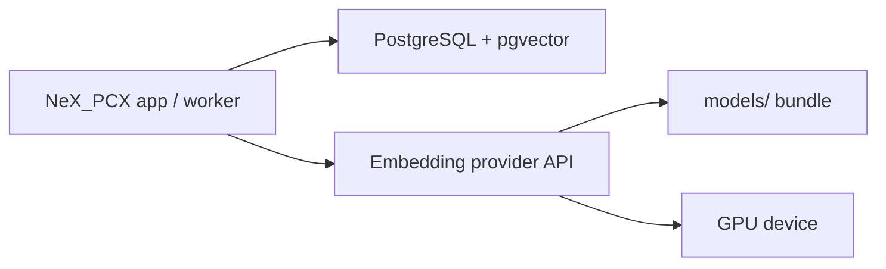

# GPU Embedding Provider Deployment Guide

Slice 090 defines the deployment path for running heavy embedding inference outside the
main NeX_PCX web/API process.

The main application should stay close to PostgreSQL and the upload/search UI. GPU-bound
model execution should run in a separate provider process that preloads model bundles and
implements the stable provider API from `docs/embedding_provider_architecture.md`.

## Recommended Topology



Use this split for benchmark ingestion and customer-site installs:

- NeX_PCX app server: upload, parsing, chunking, job queues, permissions, search logs.
- PostgreSQL server: metadata, job state, pgvector tables, evaluation records.
- GPU provider server: model preload, batching, inference, dimension-specific output.
- Model bundle: copied into `models/` or another `NEX_PCX_MODELS_DIR` equivalent path.

The provider should not download models during startup in production. It should start only
after the model bundle has already been copied and verified.

## Model Bundle Preparation

Create the bundle in a connected build/development environment:

```bash
./.venv/bin/pip install -e ".[models]"
./.venv/bin/python scripts/download_embedding_models.py --dry-run
./.venv/bin/python scripts/download_embedding_models.py
./.venv/bin/python scripts/check_embedding_models.py --dry-run
```

Expected directories:

- `models/kure_v1`
- `models/bge_m3`
- `models/qwen3_embedding_4b`

For offline or customer-site installs, copy this directory tree as a release artifact. Keep
the directory names stable because NeX_PCX uses them as the local distribution contract.

Recommended release checks before copying:

- Verify that all expected directories contain `config.json` and model weight files.
- Record total size and file count per model.
- Generate a checksum manifest for the model bundle archive.
- Keep the model bundle version together with the application release notes.
- Do not commit model files to git.

## Provider API Contract

The provider exposes:

- `GET /healthz`
- `POST /v1/embeddings`

Health response fields:

```json
{
  "ready": true,
  "provider_type": "remote",
  "provider_model_id": "gpu-kure-v1-2026-07",
  "model_key": "kure_v1",
  "profile_names": ["kure_v1_1024"],
  "dimension": 1024,
  "device": "cuda:0",
  "runtime_metadata": {
    "model_source": "/srv/nex_pcx/models/kure_v1"
  }
}
```

Embedding request shape:

```json
{
  "profile_name": "kure_v1_1024",
  "model_key": "kure_v1",
  "input_type": "document",
  "texts": ["A chunk of document text."],
  "normalize_embeddings": true,
  "output_dimension": 1024,
  "trace_id": "embedding-job-123",
  "runtime_metadata": {}
}
```

Embedding response shape:

```json
{
  "embeddings": [[0.01, 0.02, 0.03]],
  "dimension": 1024,
  "provider_model_id": "gpu-kure-v1-2026-07",
  "provider_type": "remote",
  "elapsed_ms": 18,
  "input_count": 1,
  "runtime_metadata": {
    "device": "cuda:0",
    "batch_size": 1
  }
}
```

The NeX_PCX worker validates output dimension, row count, finite numeric values, and
provider metadata before storing vectors in pgvector.

## Model Placement Strategy

Start with one provider process per GPU/model family:

- KURE provider: `kure_v1_1024`
- BGE provider: `bge_m3_1024`
- Qwen provider: `qwen3_4b_1000` and `qwen3_4b_2560` served by the same loaded model

Qwen is the largest bundle and should normally be GPU-only. Keep both Qwen profiles routed
to the same loaded model, while honoring each request's `output_dimension` and storage
profile metadata.

For a shared Qwen provider, register both `qwen3_4b_1000` and `qwen3_4b_2560` routes
against the same `provider_base_url`. The provider health response may set
`dimension` to `null` and expose profile-specific dimensions in runtime metadata:

```json
{
  "runtime_metadata": {
    "profile_dimensions": {
      "qwen3_4b_1000": 1000,
      "qwen3_4b_2560": 2560
    }
  }
}
```

Avoid loading all large models into one small GPU process unless memory has been measured.
For early experiments, prefer explicit routing over clever auto-balancing.

## Local Launch And Route Helper

NeX_PCX provides local operation helpers for launching provider processes and registering
routes:

```bash
./.venv/bin/python scripts/run_embedding_provider.py --provider kure
./.venv/bin/python scripts/run_embedding_provider.py --provider bge
./.venv/bin/python scripts/run_embedding_provider.py --provider qwen
```

The default local ports are:

- KURE: `9101`
- BGE-M3: `9102`
- Qwen shared provider: `9103`

Register routes after the database is migrated:

```bash
./.venv/bin/python scripts/register_embedding_provider_routes.py \
  --provider all \
  --database-url "$NEX_PCX_DATABASE_URL"
```

Use `--dry-run --json` first when checking a new host, port, or provider name. For a
remote GPU host, pass `--host <gpu-hostname>` or a single-provider `--base-url`.

## Startup Checklist

On the GPU server:

1. Copy the verified `models/` bundle to a local disk path.
2. Install provider runtime dependencies for the target accelerator.
3. Start the provider with a fixed model key and device.
4. Load the model during startup, before reporting `ready=true`.
5. Run `GET /healthz` and verify model key, profile names, dimension, and device.
6. Run one `POST /v1/embeddings` smoke request per profile.
7. Record provider version, model source path, device, and model bundle checksum.

On the NeX_PCX app server:

1. Confirm PostgreSQL migrations are current.
2. Confirm the embedding worker can reach the provider URL.
3. Start with a small job batch and short queue lease.
4. Check job runtime metadata for provider fields.
5. Review vector dimensions and search logs after the first ingestion run.

## Operational Guidance

Keep queue ownership in NeX_PCX. The provider should be mostly stateless, apart from loaded
model instances and in-process batching. This keeps retries, permissions, and experiment
metadata consistent in PostgreSQL.

Recommended provider behavior:

- Reject blank text and unsupported profiles.
- Cap request batch size.
- Return fast health responses without running inference.
- Include `provider_model_id`, `device`, `batch_size`, and elapsed time in metadata.
- Fail startup if the configured model directory is missing or incomplete.
- Prefer explicit model version identifiers over mutable labels like `latest`.

Recommended NeX_PCX worker behavior:

- Use queue leasing to control concurrency.
- Retry transient provider failures through job retry policy.
- Mark invalid provider output as a failed embedding job.
- Store provider metadata with each completed embedding job.
- Keep local SentenceTransformers smoke checks separate from production ingestion.

## Network And Security

For company/customer deployments, keep the provider on a private network segment. Use
firewall rules or service mesh policy so only NeX_PCX workers can call it.

Minimum controls:

- Private address or internal DNS only.
- TLS at the ingress boundary when traffic crosses hosts.
- Request size limits for `/v1/embeddings`.
- Access logs that include trace ID but not full document text.
- No public model downloads from production startup paths.

## Failure Modes

| Failure | Expected handling |
| --- | --- |
| Provider not reachable | Worker marks job failed or retries according to queue policy. |
| Provider `ready=false` | Do not claim large batches until the provider is ready. |
| Dimension mismatch | Worker rejects response before pgvector storage. |
| GPU out of memory | Provider returns an error; reduce batch size or split models by process. |
| Model bundle missing | Provider startup fails; fix deployment artifact before traffic. |
| Slow CPU fallback | Use only for smoke/debug; route benchmark ingestion to GPU provider. |

## Current Implementation Status

Implemented:

- Local model bundle manifest and download script.
- Local SentenceTransformers smoke CLI for KURE/BGE style models.
- Provider request/response validation.
- Remote provider HTTP client contract.
- Embedding worker path that can process jobs through an injected provider.

Still intentionally pending:

- Concrete GPU provider service implementation.
- Runtime configuration that maps embedding profiles to provider base URLs.
- Worker process command that uses the remote provider client instead of injection tests.
- Provider-side batching, auth, and deployment packaging.

These pending items are good candidates for the next implementation slices.
